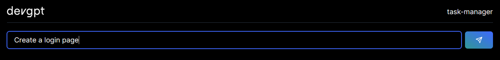

# 🪄 Prompting

## Basic prompting

To get started with prompting, you can just simply enter your task.&#x20;

<figure><figcaption>
EXAMPLE OF PROMPTING
</figcaption></figure>

## In depth prompting&#x20;

You can use @ in your prompts to search for files in your repo.&#x20;

<figure><figcaption>
EXAMPLE OF SEARCHING FOR FILES
</figcaption></figure>
